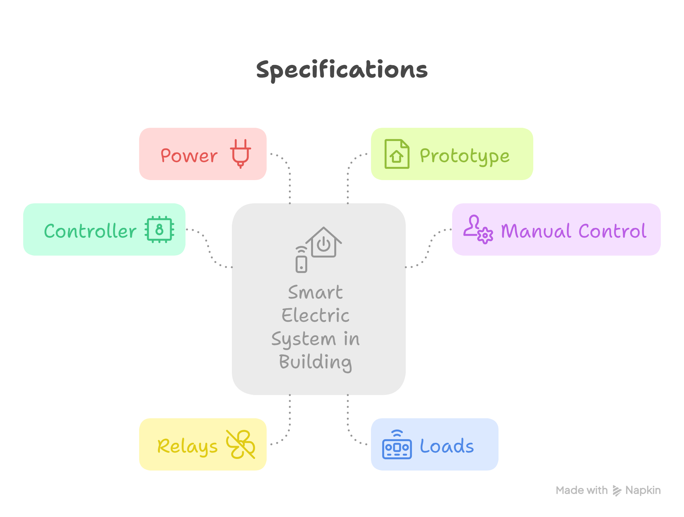

# Smart Electric System in Building (ESP32 + Blynk, 4× AC Bulbs, Manual Buttons)

This project demonstrates controlling **4 AC light bulbs wirelessly** using an **ESP32** and the **Blynk** app, plus **manual buttons** for local control.  
Built as a **Final Year Project (FYP) prototype** on a **wooden board**.

> ⚠️ **Prototype Only.** Not for permanent household use. Handle AC wiring with proper insulation, fuse protection, and supervision.

---

## 1) Project Overview
- **Objective:** Wi-Fi app control + **manual buttons** (like wall switches) on a demo board.
- **Core Idea:** ESP32 receives commands from Blynk **or** local button press → drives relays → toggles AC bulbs.
- **Outcome:** Two-way control with a single source of truth (ESP32 logic keeps app and buttons in sync).

---

## 2) Hardware 
1. ESP32 with expansion board  
2. 4-CH Active H/L 5V Relay Module (opto-isolated, 10A @ 250VAC)  
3. 5V 2A DC adapter  
4. LED E27 bulbs (5–10W recommended) ×4  
5. E27 bulb holders ×4  
6. **Momentary push buttons (NO)** ×4 (22mm panel type) 
7. Inline fuse (2–3A, slow blow) + fuse holder  
8. Terminal blocks, hookup wires, labels, cable ties  
9. Wooden mounting board

---

## 3) Methodology
ESP32 runs a **logic switch** model: both the **Blynk app** and **local buttons** request state changes; ESP32 **owns the ground truth** and updates **relays** and **Blynk UI** accordingly.

---

## 4) Technique & Procedure
1. **Blynk Setup**
   - Create a device/template and 4 **Switch** widgets bound to **V0–V3** (0/1).
2. **Wiring (Low Voltage)**
   - ESP32 GPIO16..19 → Relay IN1..IN4  
   - **Buttons (momentary NO)**: one side → ESP32 GPIO (e.g., 21/22/23/25), other side → **GND** (use `INPUT_PULLUP`).
   - Share **GND** between ESP32, relay board, and 5V adapter.
3. **Wiring (Mains)**
   - **Live** → **Fuse** → Relay **COM1..COM4** (bridged).  
   - Relay **NO1..NO4** → Bulbs **Live**.  
   - **Neutral** → common neutral bus to bulbs.
4. **Firmware**
   - On Blynk `V0–V3` write → set state, drive relay, reflect to app.
   - On **button press** → **toggle** channel state (debounced), drive relay, reflect to app.
5. **Demo Assembly**
   - Mount parts on wooden board; route AC and DC on **separate lanes**; add big **CAUTION** label.
   - Test one channel at a time, then full system.

---

## 5) Estimated Cost (MYR, prototype)
| Item                  | Qty | Unit (RM) | Subtotal (RM) |
|-----------------------|-----|-----------|---------------|
| ESP32 + Expansion Bd. | 1   |    40     |    40         |
| 4-CH Relay Module     | 1   |    13     |    13         |
| 5V/2A Adapter         | 1   |    14     |    14         |
| LED Bulbs (5–10W)     | 4   |     7     |    28         |
| Bulb Holders          | 4   |     7     |    28         |
| Momentary Buttons (NO)| 4   |     6     |    24         |
| Fuse + Holder         | 1   |    26     |    26         |
| Wires, board, misc.   | —   |    30     |    30         |
| **Total (approx.)**   |     |           |   **204**     |

---

## 6) Specifications
- **Controller:** ESP32 (Wi-Fi, Blynk IoT)  
- **Manual Control:** 4× momentary NO buttons (GPIO with `INPUT_PULLUP`)  
- **Relays:** 4 channels, opto-isolated, 10A @ 250VAC (mechanical)  
- **Loads:** 4× LED bulbs (5–10W each)  
- **Power:** 5V 2A DC adapter (ESP32 + relay coils)  
- **Prototype:** Wooden board mounting with labeled channels and safety fuse

---

## 7) Wiring Tables

### 7.1 Low-Voltage (ESP32, Buttons, Relays, 5V)
| Component     | Pin / Terminal  | Connects To               | Notes                |
|---------------|-----------------|---------------------------|----------------------|
| ESP32         | 5V / VIN        | Relay VCC & 5V adapter +  | Power to relay board |
| ESP32         | GND             | Relay GND & 5V adapter –  | Common ground        |
| ESP32         | GPIO16          | Relay IN1                 | Channel 1 control    |
| ESP32         | GPIO17          | Relay IN2                 | Channel 2 control    |
| ESP32         | GPIO18          | Relay IN3                 | Channel 3 control    |
| ESP32         | GPIO19          | Relay IN4                 | Channel 4 control    |
| Button 1 (NO) | One leg         | ESP32 **GPIO21**          | Set `INPUT_PULLUP`   |
|               | Other leg       | ESP32 **GND**             | Press → LOW          |
| Button 2 (NO) | One leg         | ESP32 **GPIO22**          | 〃 |
|               | Other leg       | ESP32 **GND**             | 〃 |
| Button 3 (NO) | One leg         | ESP32 **GPIO23**          | 〃 |
|               | Other leg       | ESP32 **GND**             | 〃 |
| Button 4 (NO) | One leg         | ESP32 **GPIO25**          | 〃 |
|               | Other leg       | ESP32 **GND**             | 〃 |

### 7.2 Mains (Fuse, Relays, Bulbs)
| Component        | Pin / Terminal | Connects To                  | Notes  |
|------------------|-----------------|------------------------------|-------|
| AC **Live**      | —               | **Fuse** → Relay **COM1–4**  | Bridge COM1–COM4 after fuse |
| Relay CH1        | **NO1**         | Bulb 1 **Live**              | Switched live |
| Relay CH2        | **NO2**         | Bulb 2 **Live**              | 〃 |
| Relay CH3        | **NO3**         | Bulb 3 **Live**              | 〃 |
| Relay CH4        | **NO4**         | Bulb 4 **Live**              | 〃 |
| AC **Neutral**   | —               | Bulbs Neutral (common bus)   | Direct |
| Earth (if any)   | —               | As required by fixtures      | Safety/metal parts |

---

## 8) How It Works
1. ESP32 boots, connects to Wi-Fi and Blynk.  
2. **Blynk Switch (V0–V3)** or **Button press** requests a channel toggle.  
3. ESP32 updates the **channel state**, drives the **relay**, and **reflects state** back to the Blynk UI.  
4. Bulbs turn ON/OFF via **NO** contacts switching the **Live** conductor.

---

## 9) Firmware Scaffold (Option A)
- Configure pins: `RELAY[4] = {16,17,18,19}`, `BUTTON[4] = {21,22,23,25}`  
- Set buttons `INPUT_PULLUP`, debounce ~100–150 ms  
- On Blynk write → set state + drive relay + `virtualWrite()`  
- On button press → **toggle** state + drive relay + `virtualWrite()`  
(See `/firmware/main.cpp` for the full example.)

---

## 10) Safety Checklist
- **Inline fuse** on Live before relay COM bridge.  
- Keep AC and DC physically separated on the board.  
- Use terminal blocks/heatshrink for all mains joints.  
- Label channels and add a visible **CAUTION: 230V/120V AC** sign.  
- Never touch the board while powered.

---

## 11) License
Licensed under the **MIT License** — see [`LICENSE`](./LICENSE).

